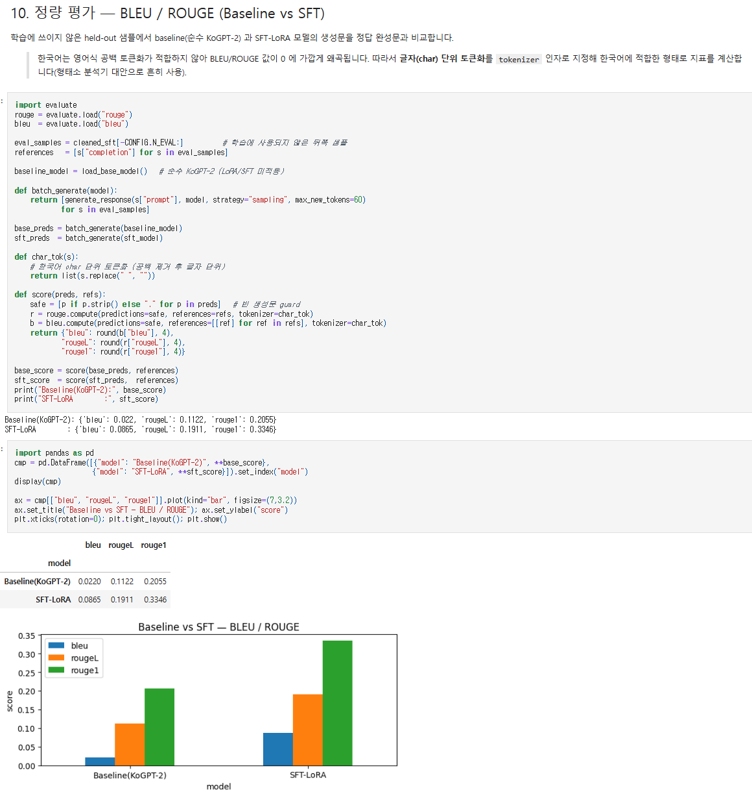
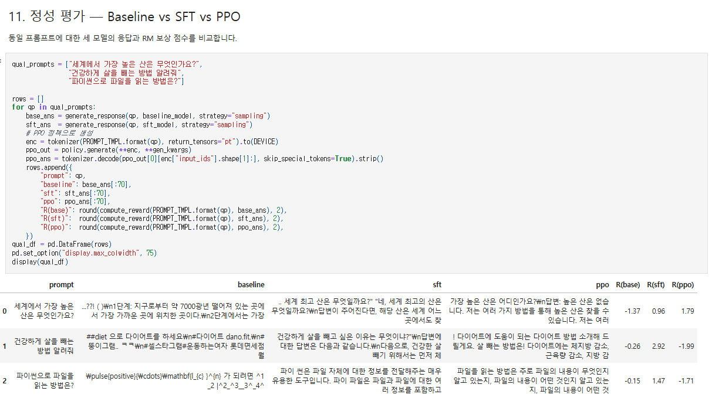
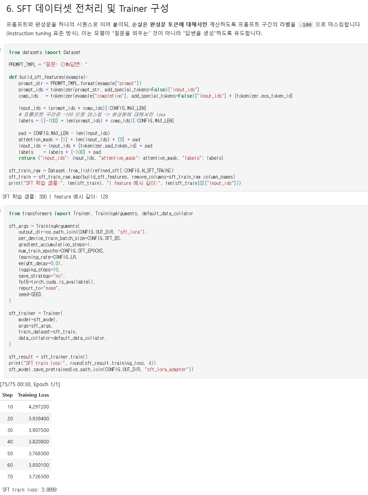
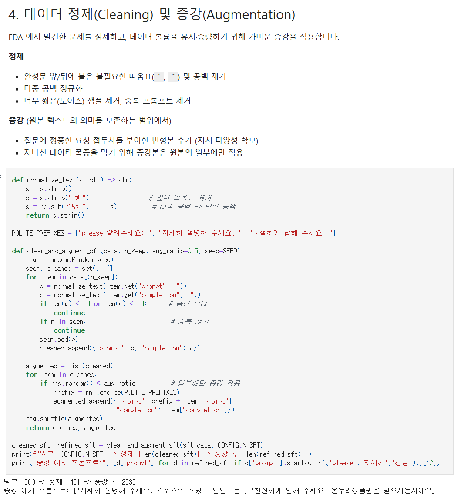
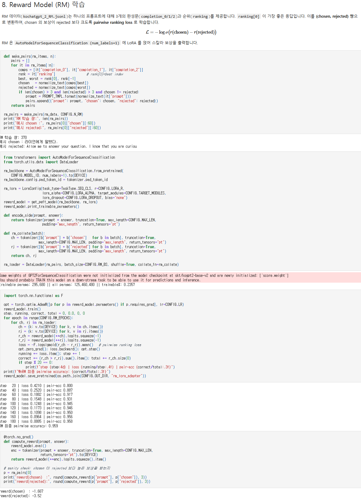
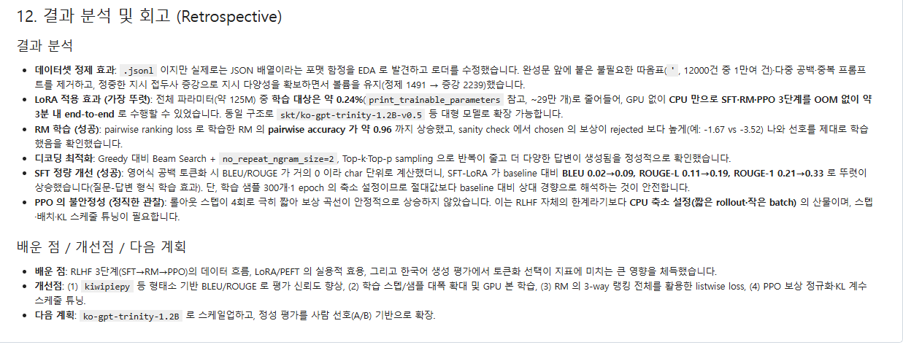

# AIFFEL Campus Online Code Peer Review Template

- 코더: 조희연
- 리뷰어: 김수경

# PRT (Peer Review Template)

- [x] **1. 주어진 문제를 해결하는 완성된 코드가 제출되었나요?**

  - 데이터 로드와 EDA부터 정제·증강, LoRA 기반 SFT, Reward Model 학습, PPO, 정량·정성 평가까지 전체 과정이 하나의 노트북에서 순서대로 실행되도록 완성되어 있습니다.
  - CPU 환경에서도 실행할 수 있도록 학습 샘플과 스텝 수를 축소한 설정을 제공했고, 각 단계의 결과도 출력으로 확인할 수 있습니다.
  - 주요 실행 결과는 다음과 같습니다.
    - SFT 학습 손실: `3.8899`
    - Reward Model 최종 pairwise accuracy: `0.959`
    - Baseline → SFT-LoRA BLEU: `0.0220 → 0.0865`
    - Baseline → SFT-LoRA ROUGE-L: `0.1122 → 0.1911`
    - Baseline → SFT-LoRA ROUGE-1: `0.2055 → 0.3346`
  - PPO 보상이 안정적으로 상승하지 않은 결과도 숨기지 않고, 짧은 rollout과 작은 batch를 사용한 CPU 축소 실험의 한계로 분석했습니다.
  - 근거: [`KoChatGPT_LoRA.ipynb`](./KoChatGPT_LoRA.ipynb)의 **10. 정량 평가**, **11. 정성 평가**, **12. 결과 분석 및 회고**

  **정량 평가 근거 — Baseline과 SFT의 BLEU·ROUGE 비교**

  

  **정성 평가 근거 — Baseline·SFT·PPO 응답 및 RM 보상 비교**

  

- [x] **2. 전체 코드에서 가장 핵심적이거나 복잡한 부분의 주석 또는 docstring을 보고 코드를 잘 이해할 수 있었나요?**

  - 핵심 부분은 SFT 전처리 함수인 `build_sft_features()`라고 생각합니다. 프롬프트와 답변을 하나의 시퀀스로 구성하면서 프롬프트 토큰의 라벨을 `-100`으로 마스킹하여, 답변 토큰에 대해서만 손실을 계산하도록 구현했습니다.
  - 해당 코드에는 “프롬프트 구간은 `-100`으로 마스킹 → 완성문에 대해서만 loss”라는 주석이 있어 instruction tuning의 목적과 구현 방식을 쉽게 이해할 수 있었습니다.

  ```python
  input_ids = (prompt_ids + comp_ids)[:CONFIG.MAX_LEN]
  labels = ([-100] * len(prompt_ids) + comp_ids)[:CONFIG.MAX_LEN]

  pad = CONFIG.MAX_LEN - len(input_ids)
  attention_mask = [1] * len(input_ids) + [0] * pad
  ```

  - `load_kochatgpt()`에도 JSON 배열과 실제 JSONL 형식을 모두 처리하는 이유가 docstring으로 설명되어 있고, LoRA 설정에서는 GPT-2의 `c_attn`을 대상으로 지정한 이유와 잘못된 인자명을 수정한 내용이 주석으로 명확히 기록되어 있습니다.
  - 근거: 노트북의 **3. 데이터셋 로드 및 EDA**, **5. LoRA 설정**, **6. SFT 데이터셋 전처리**

  **핵심 코드 근거 — SFT 데이터 전처리와 라벨 마스킹**

  

- [x] **3. 에러가 난 부분을 디버깅하여 해결한 기록을 남겼거나 새로운 시도 또는 추가 실험을 수행했나요?**

  - 확장자는 `.jsonl`이지만 실제 데이터는 하나의 JSON 배열로 저장되어 있다는 문제를 발견하고, JSON 배열과 JSONL을 모두 안전하게 읽는 로더로 수정했습니다.
  - LoRA 설정의 잘못된 인자명인 `target_fcs`와 `lora_drop`을 각각 `target_modules`, `lora_dropout`으로 수정했습니다.
  - 한국어 문장에 영어식 공백 토큰화를 적용하면 BLEU/ROUGE가 지나치게 낮아지는 문제를 확인하고, 공백을 제거한 글자 단위 토큰화 방식으로 평가를 개선했습니다.
  - Greedy, Beam Search, Top-k·Top-p Sampling을 동일 프롬프트로 비교하고 `no_repeat_ngram_size=2`를 적용해 반복 생성을 줄이는 추가 실험을 수행했습니다.
  - 전체 파라미터 약 1억 2,545만 개 중 약 29만 개(`0.2351%`)만 학습하도록 LoRA를 적용해 CPU에서도 SFT·RM·PPO를 실행한 점이 인상적입니다.
  - 근거: 노트북의 **3. 데이터셋 로드**, **5. LoRA 설정**, **7. 디코딩 전략**, **10. 정량 평가**
  - 다만 정제 전·후 모델을 동일 조건으로 학습한 직접 비교는 없으므로, BLEU·ROUGE 향상을 데이터 정제만의 효과로 단정하지 않고 전체 SFT 파이프라인의 결과로 해석해야 합니다.

  **추가 실험 근거 — 데이터 정제 및 증강**

  

  **추가 학습 근거 — Reward Model 학습과 보상 검증**

  

- [x] **4. 회고를 잘 작성했나요?**

  - 결과 분석에서 데이터 정제, LoRA, RM, 디코딩, SFT, PPO의 결과를 각각 구분하여 성공한 부분과 한계를 모두 구체적인 수치와 함께 설명했습니다.
  - 배운 점으로 RLHF의 `SFT → RM → PPO` 흐름, LoRA/PEFT의 효율성, 한국어 평가 토큰화의 중요성을 정리했습니다.
  - 개선점으로 형태소 기반 평가, GPU를 활용한 학습 규모 확대, listwise RM loss, PPO 보상 정규화와 KL 계수 조정을 제안했습니다.
  - 다음 계획으로 `ko-gpt-trinity-1.2B` 모델 확장과 사람 선호 기반 A/B 평가를 제시해 후속 실험 방향도 명확합니다.
  - 특히 PPO 보상이 `[0.294, 0.142, -0.715, -2.024]`로 하락한 결과를 실패로 숨기지 않고, 축소된 실험 설정의 한계와 필요한 튜닝 방향을 솔직하게 분석한 점이 좋았습니다.
  - SFT와 RM의 관계도 정확합니다. RM 자체의 생성문을 비교한 것이 아니라, SFT 모델과 RM 보상으로 최적화한 PPO 정책의 생성 결과 및 보상 점수를 비교했습니다.

  **회고 작성 근거**

  

## 회고

KoChatGPT의 SFT·RM·PPO 파이프라인을 단순히 재현하는 데 그치지 않고, 데이터 포맷 오류를 수정하고 정제·증강, LoRA, 디코딩 비교, 한국어 평가 방식까지 확장한 부분을 보고 배울 수 있었습니다. 기존 KoGPT-2와 SFT-LoRA의 정량·정성 비교는 평가 기준을 충족하고, RM의 선호 학습 결과도 pairwise accuracy와 보상 점수로 확인했습니다.  
데이터 정제와 디코딩 전략 각각의 독립적인 효과를 확인하는 ablation 실험, 그리고 여러 평가 프롬프트에서 계산한 SFT와 PPO의 평균 RM 보상 비교가 추가되면 좋았을거 같습니다.  
특히 모든 단계를 CPU에서 실행할 수 있도록 구성하면서도 성공한 결과와 실패한 결과를 모두 수치로 남겨 재현성과 이해도를 높이신 부분이 좋았습니다.
