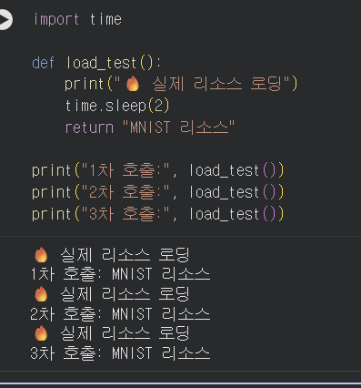

# Day 4 — Streamlit & System Architecture

## 학습 목표

- Streamlit의 기본 동작 원리와 스크립트 재실행 모델을 이해한다.
- `st.cache_resource` 적용 전후의 차이를 확인한다.
- Frontend와 Backend를 분리하는 시스템 아키텍처를 이해한다.
- Streamlit에서 FastAPI API를 호출하는 방법을 실습한다.
- 이미지 업로드 → FastAPI 호출 → MNIST 모델 추론 → 결과 시각화까지 하나의 서비스로 구현한다.


---

# 1. Streamlit 소개: Python만으로 만드는 웹 UI

Streamlit은 Python 코드만으로 데이터 분석 및 AI 모델용 웹 UI를 빠르게 만들 수 있는 프레임워크이다.

버튼, 입력창, 이미지 업로드, 그래프 등의 UI를 Python 코드로 구성할 수 있다.

### ✅ 체크포인트

### Streamlit의 스크립트 재실행 모델이란 무엇입니까?

사용자가 버튼을 클릭하거나 입력값을 변경하는 등 UI와 상호작용하면 Streamlit은 기본적으로 Python 스크립트를 위에서부터 다시 실행한다.

따라서 일반 변수는 재실행 과정에서 다시 만들어질 수 있으며, 유지해야 하는 값은 `st.session_state` 또는 캐시 기능을 사용할 수 있다.


### `st.text_input()`에 값을 입력하면 내부적으로 어떤 일이 일어납니까?

사용자가 `st.text_input()`의 값을 변경하면 Streamlit이 변경된 값을 전달하고 스크립트를 다시 실행한다.

재실행된 코드에서는 `st.text_input()`이 사용자가 입력한 현재 값을 반환한다.


### `st.set_page_config()`를 스크립트 중간에 호출하면 어떻게 됩니까?

`st.set_page_config()`는 페이지 제목, 아이콘, 레이아웃 등을 설정하는 함수이다.

일반적으로 Streamlit 명령 중 가장 먼저 호출해야 하므로 다음과 같이 파일 상단에서 설정한다.

```python
st.set_page_config(
    page_title="MNIST 숫자 인식",
    page_icon="🔢",
    layout="wide"
)
```


---

# 2. Streamlit 핵심 컨셉

Streamlit에서는 파일 업로드, 상태 관리, 캐시 등을 이용하여 사용자와 상호작용하는 웹 애플리케이션을 만들 수 있다.

### ✅ 체크포인트

### `st.file_uploader()`로 업로드된 파일의 바이트 데이터는 어떻게 얻습니까?

`st.file_uploader()`가 반환한 객체에서 `getvalue()`를 사용한다.

```python
uploaded = st.file_uploader("이미지를 업로드하세요.")

if uploaded:
    image_bytes = uploaded.getvalue()
```

`image_bytes`에는 업로드한 이미지의 바이트 데이터가 저장된다.


### Streamlit에서 `@st.cache_resource`를 사용하는 이유는 무엇입니까?

Streamlit은 사용자가 UI를 조작할 때 스크립트를 다시 실행한다.

모델이나 데이터셋처럼 생성 비용이 큰 리소스를 매번 다시 로딩하면 불필요한 시간이 발생한다.

`@st.cache_resource`를 사용하면 처음 생성한 리소스를 캐시에 저장하고 이후 재실행에서 재사용할 수 있다.

### 캐시 적용 전

```python
def load_test():
    print("🔥 실제 리소스 로딩")
    return "MNIST 리소스"
```

함수를 세 번 호출하면 리소스 로딩도 세 번 발생하는 것을 확인하였다.



**확인 결과**

```text
실제 리소스 로딩 → 1차 호출
실제 리소스 로딩 → 2차 호출
실제 리소스 로딩 → 3차 호출
```

즉, 캐시가 없으면 호출할 때마다 리소스 로딩 코드가 다시 실행된다.


### 캐시 적용 후

```python
@st.cache_resource
def load_test():
    print("🔥 실제 리소스 로딩")
    return "MNIST 리소스"
```

동일하게 함수를 세 번 호출하였다.


**확인 결과**

```text
🔥 실제 리소스 로딩
1차 호출: MNIST 리소스
2차 호출: MNIST 리소스
3차 호출: MNIST 리소스
```

함수는 세 번 호출했지만 실제 리소스 로딩은 한 번만 발생하였다.

따라서 `@st.cache_resource`를 사용하면 모델이나 데이터셋과 같은 무거운 리소스를 반복해서 로딩하지 않고 재사용할 수 있음을 확인하였다.


---

# 3. System Architecture: Frontend와 Backend의 역할 분리

이번 실습에서는 시스템을 다음과 같이 구성하였다.

```text
사용자
   ↓
Streamlit Frontend
   ↓
HTTP API 요청
   ↓
FastAPI Backend
   ↓
MNIST 모델
   ↓
추론 결과
   ↓
FastAPI Response
   ↓
Streamlit 화면 표시
```

Streamlit은 사용자 화면을 담당하고 FastAPI는 모델 실행과 API 처리를 담당한다.


### ✅ 체크포인트

### 모놀리식과 분리 아키텍처의 핵심 차이를 한 문장으로 설명하세요.

모놀리식 구조는 UI, 비즈니스 로직, 모델 등을 하나의 애플리케이션에서 처리하지만, 분리 아키텍처는 Frontend와 Backend를 독립적인 서비스로 나누어 통신하도록 구성한다.


### 모델을 업데이트할 때, 분리 아키텍처에서는 어떤 서버만 재배포하면 됩니까?

모델이 FastAPI Backend에서 실행되는 구조라면 모델을 업데이트할 때 주로 **Backend 서버를 재배포**하면 된다.

Frontend의 화면이나 API 사용 방법이 변경되지 않았다면 Streamlit Frontend를 함께 변경할 필요가 없다.


### Streamlit 앱에 PyTorch가 설치되어 있지 않아도 되는 이유는 무엇입니까?

PyTorch 모델을 Streamlit에서 직접 실행하지 않고 FastAPI Backend에서 실행하기 때문이다.

Streamlit은 이미지 데이터를 API로 전달하고 FastAPI가 반환한 예측 결과만 받아 화면에 표시한다.

따라서 역할은 다음과 같이 분리된다.

```text
Streamlit
→ 사용자 입력 및 결과 표시

FastAPI
→ API 처리 및 모델 호출

PyTorch
→ Backend에서 MNIST 모델 추론
```


---

# 4. Streamlit에서 FastAPI 호출하기

Streamlit Frontend에서 `requests`를 사용하여 FastAPI Backend의 API를 호출하였다.

```python
resp = requests.post(
    url,
    json=json_data,
    timeout=30
)

resp.raise_for_status()
result = resp.json()
```


### ✅ 체크포인트

### 이미지를 API에 전송할 때 Base64로 인코딩하는 이유는 무엇입니까?

이미지는 바이너리 데이터이므로 JSON에 그대로 넣기 어렵다.

따라서 이미지 바이트를 Base64 문자열로 변환하여 JSON 데이터에 포함시켜 전송할 수 있다.

```python
image_base64 = base64.b64encode(image_bytes).decode("utf-8")
```

전송 구조는 다음과 같다.

```text
이미지
 ↓
바이트 데이터
 ↓
Base64 문자열
 ↓
JSON Request
 ↓
FastAPI
```


### `response.raise_for_status()`는 어떤 역할을 합니까?

HTTP 응답이 오류 상태인지 확인하는 역할을 한다.

예를 들어 서버가 `400`, `404`, `500` 등의 오류 상태 코드를 반환하면 `raise_for_status()`가 예외를 발생시킨다.

이를 이용하면 API 호출 실패를 감지하여 사용자에게 적절한 오류 메시지를 보여줄 수 있다.


---

# 5. 실습: MNIST 추론 대시보드 만들기

이번 실습에서는 FastAPI Backend와 Streamlit Frontend를 연결하여 MNIST 숫자 추론 대시보드를 구현하였다.

전체 처리 과정은 다음과 같다.

```text
① Streamlit 실행
        ↓
② 이미지 입력
        ↓
③ 이미지 Base64 인코딩
        ↓
④ FastAPI /predict/image 호출
        ↓
⑤ MNIST 모델 추론
        ↓
⑥ FastAPI가 예측 결과 반환
        ↓
⑦ Streamlit에서 결과 시각화
```


### 5.1 MNIST 추론 대시보드

Streamlit을 이용하여 이미지 입력, 추론 결과, 확신도 및 클래스별 확률을 확인할 수 있는 화면을 구현하였다.


### 5.2 MNIST 샘플 이미지 추론

MNIST 테스트셋의 숫자 3, 5, 7 샘플을 이용하여 추론을 실행하였다.

#### 숫자 3


#### 숫자 5


#### 숫자 7


샘플 이미지를 변경하면서 FastAPI Backend가 예측을 수행하고 Streamlit Frontend에 결과가 표시되는 것을 확인하였다.


### 5.3 `st.cache_resource` 적용 전후 비교

캐시 적용 전에는 리소스 함수를 호출할 때마다 실제 로딩 코드가 반복 실행되었다.


`@st.cache_resource` 적용 후에는 세 번 호출해도 실제 리소스 로딩은 최초 한 번만 실행되고 이후에는 캐시된 리소스를 재사용하였다.


### 실습 결과

이번 실습을 통해 다음 흐름이 동작하는 것을 확인하였다.

```text
Streamlit Frontend
        ↓
FastAPI Backend
        ↓
MNIST Model
        ↓
Prediction
        ↓
FastAPI Response
        ↓
Streamlit 결과 표시
```

또한 Streamlit 화면에서 `🟢 서버 연결됨` 상태를 확인하여 Frontend와 Backend가 정상적으로 연결되어 있음을 확인하였다.


---

### ✅ Day 4 최종 체크포인트

### [섹션 1: Streamlit 소개]

**Q1. Streamlit의 스크립트 재실행 모델이란?**

사용자가 버튼 클릭, 입력값 변경 등의 상호작용을 하면 Streamlit이 Python 스크립트를 위에서부터 다시 실행하는 방식이다.


### [섹션 2: 핵심 컨셉]

**Q2. `@st.cache_resource`를 사용하는 이유는?**

모델이나 데이터셋처럼 로딩 비용이 큰 리소스를 최초 한 번 생성한 뒤 캐시에 저장하여 Streamlit이 재실행되어도 반복 로딩하지 않고 재사용하기 위해 사용한다.


### [섹션 3: System Architecture]

**Q3. 프론트엔드와 백엔드를 분리하는 핵심 이유 두 가지는?**

1. UI와 모델/API의 역할을 분리하여 개발 및 유지보수를 쉽게 하기 위해서이다.
2. 모델이나 Backend가 변경될 때 전체 서비스를 수정하지 않고 필요한 부분만 독립적으로 업데이트하고 배포하기 위해서이다.


**Q4. Streamlit 앱에 PyTorch가 필요 없는 이유는?**

PyTorch 모델은 FastAPI Backend에서 실행되고 Streamlit은 API를 통해 입력 데이터를 전달하고 추론 결과만 받아서 표시하기 때문이다.


### [섹션 4: API 호출]

**Q5. API 호출 실패 시 사용자에게 스택 트레이스가 아닌 메시지를 보여줘야 하는 이유는?**

스택 트레이스는 개발자용 내부 오류 정보이므로 일반 사용자가 이해하기 어렵고 내부 시스템 정보가 불필요하게 노출될 수 있다.

따라서 사용자에게는 `서버에 연결할 수 없습니다`, `응답 시간 초과` 등 이해하기 쉬운 오류 메시지를 제공하는 것이 적절하다.


### [섹션 5: 실습]

**Q6. `st.session_state`에 결과를 저장하는 이유는?**

Streamlit은 사용자 상호작용 때마다 스크립트를 재실행하기 때문에 이전 실행에서 생성된 이미지나 추론 결과가 사라질 수 있다.

`st.session_state`에 저장하면 재실행 후에도 필요한 상태와 추론 결과를 유지할 수 있다.


**Q7. 이미지를 API로 전달할 때 Base64 인코딩이 필요한 이유는?**

이미지는 바이너리 데이터이므로 JSON에 직접 넣기 어렵다.

이미지 바이트를 Base64 문자열로 변환하면 JSON Request Body에 문자열 형태로 포함하여 FastAPI에 전달할 수 있다.


---

## Day 4 완료

- [x] Streamlit 기본 동작 이해
- [x] Streamlit 스크립트 재실행 모델 이해
- [x] `st.file_uploader()` 이미지 입력
- [x] `st.cache_resource` 적용 전후 비교
- [x] Frontend / Backend 역할 분리 이해
- [x] Streamlit → FastAPI API 호출
- [x] 이미지 Base64 인코딩
- [x] MNIST 샘플 3, 5, 7 추론
- [x] FastAPI Backend와 Streamlit Frontend 연결 확인
- [x] MNIST 추론 대시보드 동작 확인