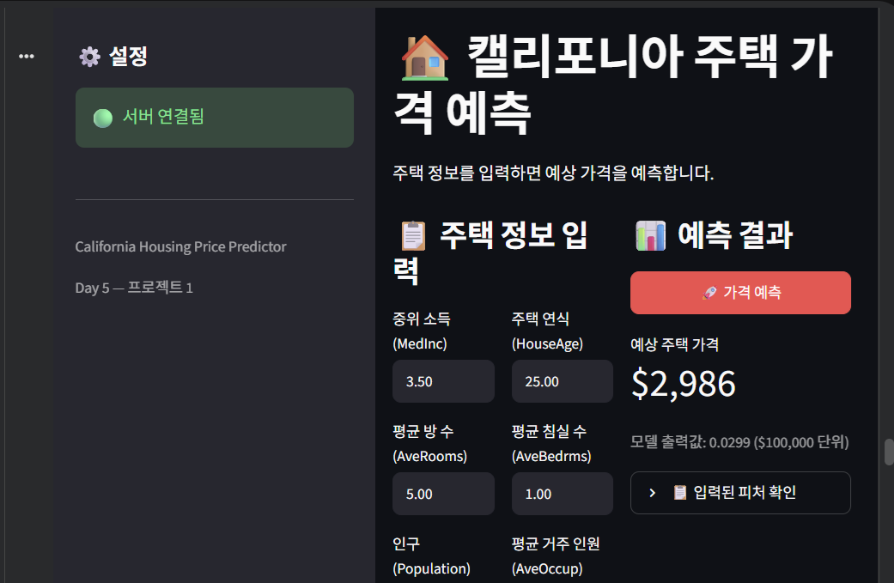
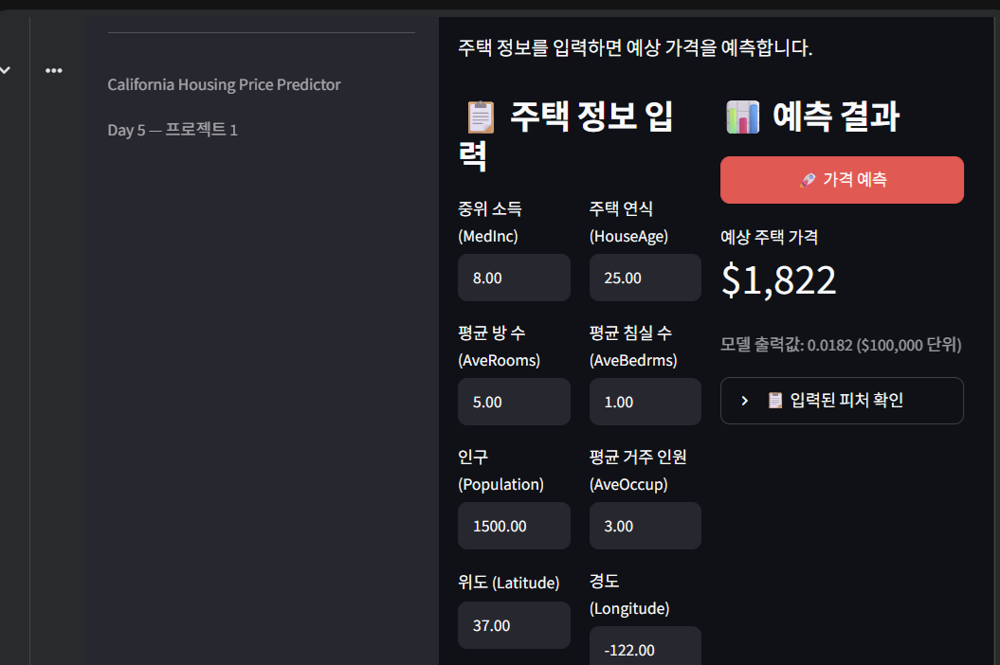
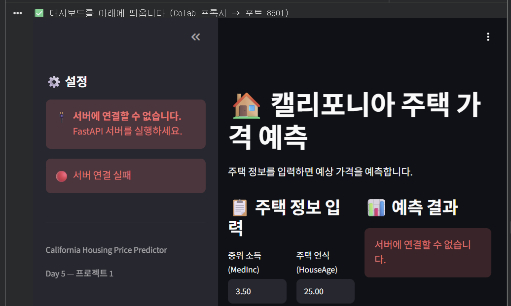
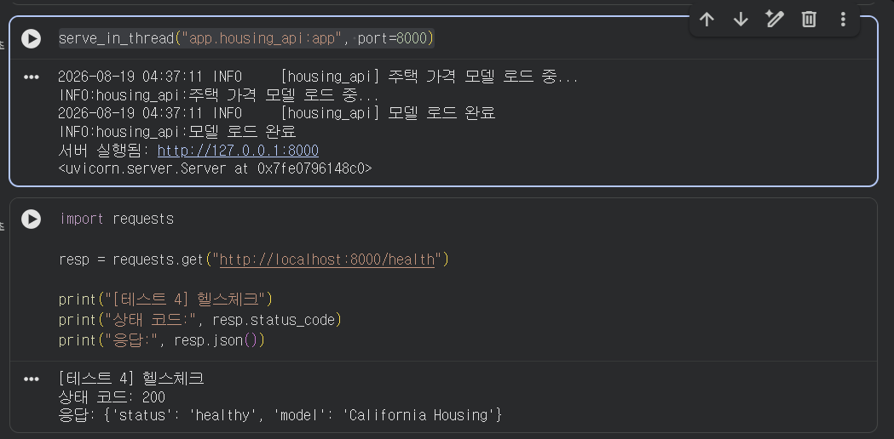

# DP05 — 모델 배포 통합 프로젝트

## 1. 프로젝트 개요

이번 실습에서는 **California Housing 주택 가격 예측 모델**을 이용하여
사용자가 웹 화면에서 데이터를 입력하고 예측 결과를 확인할 수 있는
모델 배포 시스템을 구현하였다.

전체 구조는 다음과 같다.

```text
사용자
  ↓
Streamlit
  ↓
HTTP 요청
  ↓
FastAPI
  ↓
PyTorch 예측 모델
  ↓
FastAPI 응답
  ↓
Streamlit 예측 결과 표시
```

주요 구성 요소는 다음과 같다.

- **Streamlit** : 사용자가 주택 정보를 입력하는 프론트엔드
- **FastAPI** : 입력 데이터를 받아 모델을 호출하는 백엔드 API
- **PyTorch Model** : California Housing 가격 예측
- **Health Check** : 서버와 모델의 정상 작동 상태 확인


---

# 2. 실행 및 테스트 결과

## 2.1 테스트 1 — 기본값 정상 예측

### 실습 내용

Streamlit 화면에서 기본 주택 정보를 입력한 상태로
**`🚀 가격 예측`** 버튼을 클릭하였다.

FastAPI 서버가 정상적으로 연결되어 있는지 확인하고,
Streamlit에서 입력한 데이터가 FastAPI의 `/predict` API로 전달되어
모델 추론 결과가 다시 Streamlit 화면에 표시되는지 확인하였다.

### 실행 화면



### 확인 결과

- 서버 상태 : **🟢 서버 연결됨**
- 중위 소득(MedInc) : `3.50`
- 주택 연식(HouseAge) : `25.00`
- 평균 방 수(AveRooms) : `5.00`
- 평균 침실 수(AveBedrms) : `1.00`
- 예측 결과가 Streamlit 화면에 정상적으로 표시됨

### 확인한 처리 흐름

```text
사용자 입력
   ↓
Streamlit
   ↓
POST /predict
   ↓
FastAPI
   ↓
PyTorch 모델 추론
   ↓
예측 결과 반환
   ↓
Streamlit 화면 출력
```

**결론:** 기본 입력값을 이용한 End-to-End 예측 요청이 정상적으로 처리되는 것을 확인하였다.


---

## 2.2 테스트 2 — 입력값 변경 후 예측

### 실습 내용

모델이 사용자의 입력값 변경을 실제 요청 데이터에 반영하는지 확인하기 위해
중위 소득 **MedInc 값을 3.5에서 8.0으로 변경**하였다.

값을 변경한 후 다시 **`🚀 가격 예측`** 버튼을 클릭하여
새로운 입력 데이터가 FastAPI를 거쳐 모델에 전달되는지 확인하였다.

### 실행 화면



### 확인 결과

- MedInc : `8.00`
- HouseAge : `25.00`
- AveRooms : `5.00`
- AveBedrms : `1.00`
- Population : `1500.00`
- AveOccup : `3.00`
- Latitude : `37.00`
- Longitude : `-122.00`
- 변경된 입력값을 이용한 새로운 예측 결과가 화면에 표시됨

### 확인한 처리 흐름

```text
MedInc = 8.0 입력
       ↓
Streamlit
       ↓
request_data 생성
       ↓
POST /predict
       ↓
FastAPI
       ↓
모델 추론
       ↓
새로운 예측 결과
```

> **주의:** 특정 입력 변수 하나를 증가시켰다고 해서 예측 가격이 반드시 증가하는 것은 아니다.  
> 모델은 MedInc뿐만 아니라 HouseAge, AveRooms, Population, Latitude,
> Longitude 등 여러 입력 특성을 함께 사용하여 최종 결과를 계산한다.

**결론:** Streamlit에서 변경한 입력값이 API 요청에 반영되고 모델이 새로운 예측 결과를 반환하는 것을 확인하였다.


---

## 2.3 테스트 3 — 서버 연결 실패 및 예외 처리

### 실습 내용

실제 서비스에서는 백엔드 서버가 항상 정상적으로 작동한다고 가정할 수 없다.

따라서 FastAPI 서버를 의도적으로 종료하여
Streamlit이 서버 장애 상황을 어떻게 처리하는지 테스트하였다.

서버 종료에는 다음 명령을 사용하였다.

```python
stop_server(8000)
```

### 실행 화면



### 확인 결과

FastAPI 서버 종료 후 Streamlit에서 다음 상태가 표시되는 것을 확인하였다.

```text
🔴 서버 연결 실패
서버에 연결할 수 없습니다.
FastAPI 서버를 실행하세요.
```

### 확인한 처리 흐름

```text
Streamlit
   ↓
FastAPI 요청
   ↓
서버 중단
   ↓
ConnectionError 발생
   ↓
예외 처리
   ↓
사용자에게 서버 연결 실패 표시
```

이를 통해 서버 장애가 발생하더라도 프로그램이 단순히 중단되는 것이 아니라,
사용자에게 서버 연결 문제를 알려주는 예외 처리 기능이 동작하는 것을 확인하였다.

**결론:** FastAPI 서버 장애 상황에 대한 기본적인 연결 오류 처리가 정상적으로 동작하였다.


---

## 2.4 테스트 4 — 서버 복구 및 Health Check

### 실습 내용

테스트 3에서 종료한 FastAPI 서버를 다시 실행하였다.

```python
serve_in_thread("app.housing_api:app", port=8000)
```

서버 재실행 후 `/health` API를 호출하여
FastAPI 서버와 모델이 정상 상태인지 확인하였다.

```python
import requests

resp = requests.get("http://localhost:8000/health")

print("[테스트 4] 헬스체크")
print("상태 코드:", resp.status_code)
print("응답:", resp.json())
```

### 실행 화면



### 실행 결과

```text
[테스트 4] 헬스체크
상태 코드: 200
응답: {'status': 'healthy', 'model': 'California Housing'}
```

### 확인 결과

- FastAPI 서버 재실행 성공
- `/health` API 호출 성공
- HTTP 상태 코드 : **200**
- 서버 상태 : **healthy**
- 모델 : **California Housing**

### 확인한 처리 흐름

```text
FastAPI 서버 재실행
        ↓
GET /health
        ↓
FastAPI
        ↓
서버 및 모델 상태 확인
        ↓
HTTP 200
        ↓
status = healthy
```

**결론:** 서버 장애 발생 후 FastAPI 서버를 다시 실행하고,
Health Check를 통해 서비스가 정상 상태로 복구된 것을 확인하였다.


---

# 3. 테스트 결과 종합

| 번호 | 테스트 | 주요 확인 내용 | 결과 |
|---|---|---|---|
| 1 | 기본값 정상 예측 | Streamlit → FastAPI → Model → 결과 출력 | 정상 |
| 2 | 입력값 변경 | MedInc 변경값이 모델 요청에 반영되는지 확인 | 정상 |
| 3 | 서버 장애 | FastAPI 종료 시 연결 실패 및 예외 처리 확인 | 정상 |
| 4 | 서버 복구 | `/health` HTTP 200 및 `healthy` 확인 | 정상 |

---

# 4. 최종 시스템 구조

```text
[사용자]
   │
   │ 주택 정보 입력
   ▼
[Streamlit]
   │
   │ POST /predict
   ▼
[FastAPI]
   │
   │ 입력 데이터 검증
   ▼
[Pydantic]
   │
   ▼
[PyTorch Model]
   │
   │ 가격 예측
   ▼
[FastAPI Response]
   │
   ▼
[Streamlit]
   │
   ▼
[예측 결과 표시]
```

---

# 5. 최종 결과

이번 실습에서는 단순히 머신러닝 모델을 실행하는 것을 넘어,

**Streamlit → FastAPI → PyTorch Model**

로 연결되는 모델 서비스 구조를 구현하였다.

또한 다음 네 가지 상황을 직접 테스트하였다.

1. 정상적인 모델 예측
2. 사용자 입력값 변경 후 재예측
3. FastAPI 서버 장애 및 예외 처리
4. 서버 복구 및 Health Check

이를 통해 **사용자 입력 → API 요청 → 모델 추론 → 결과 반환 → 장애 처리 → 서버 상태 확인**까지 이어지는 모델 배포의 기본 End-to-End 흐름을 확인하였다.

---

# 6. 폴더 구조

```text
DP05/
│
├── README.md
│
└── images/
    ├── 1_normal_prediction.png
    ├── 2_medinc_8_prediction.png
    ├── 3_server_connection_error.png
    └── 4_health_check.png
```