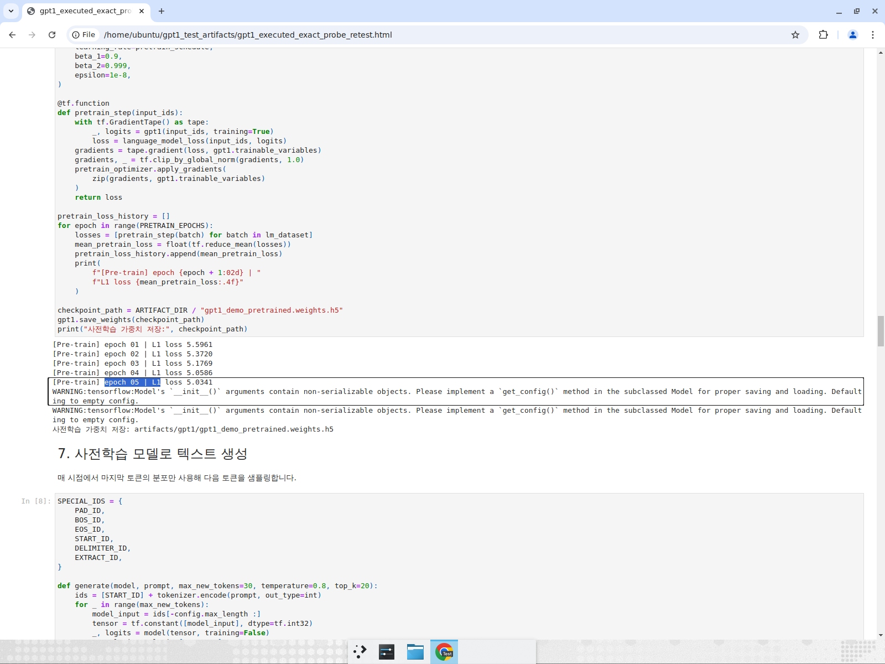
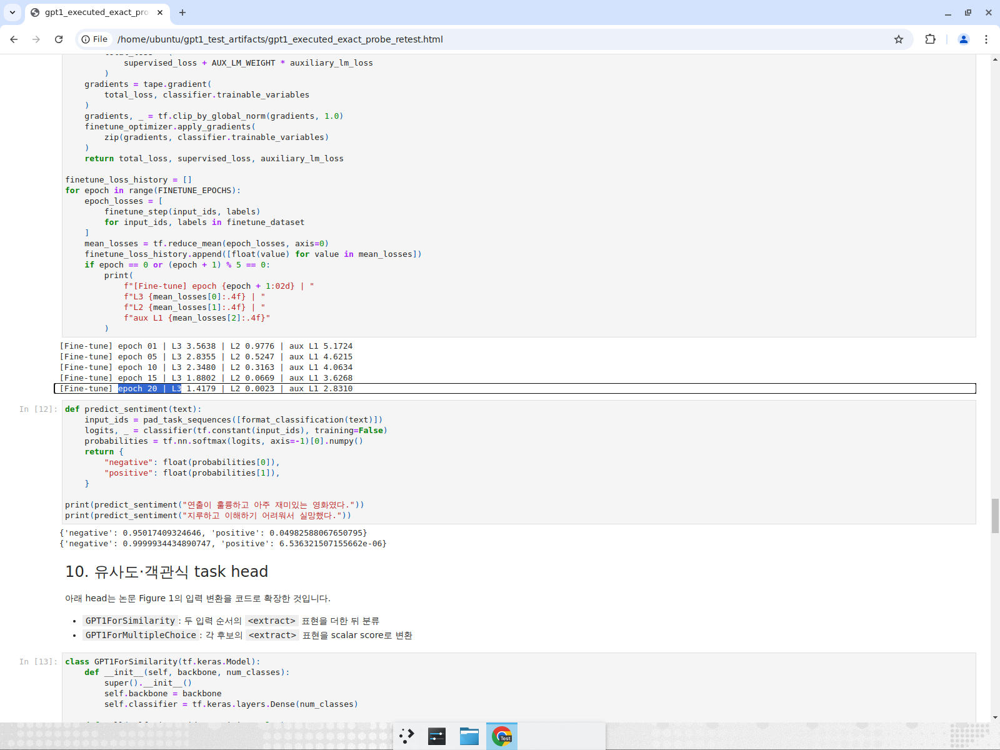
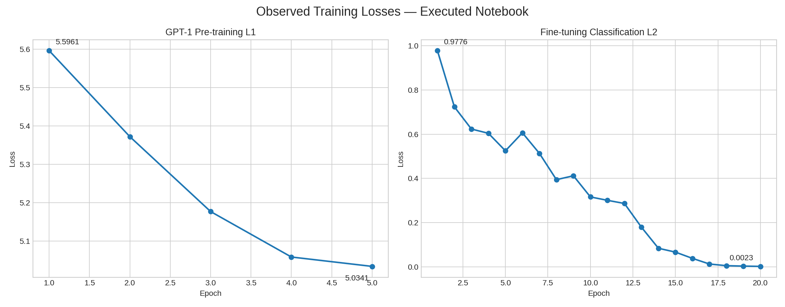
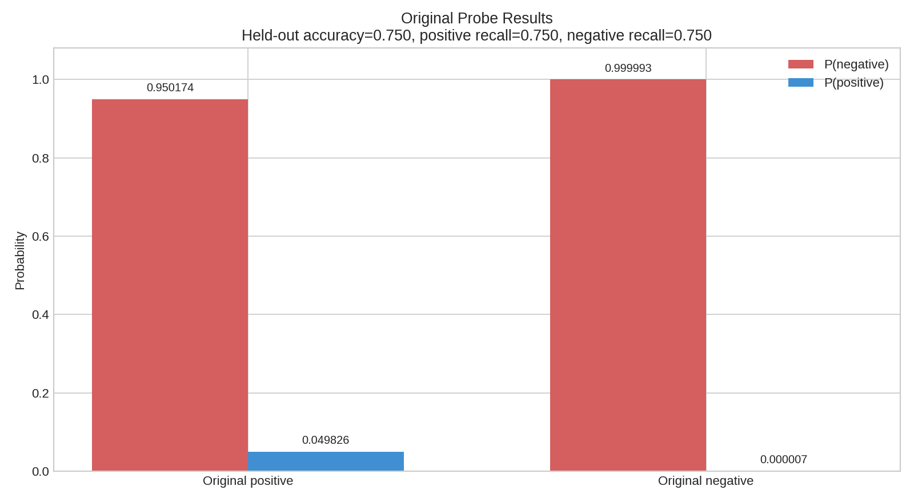
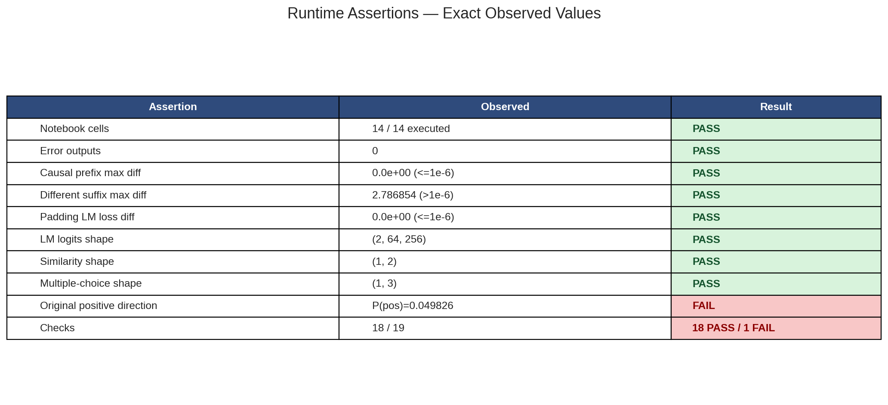

# GPT-1 Notebook Runtime Test Report

Executed the complete `Main_Quest/MQ03/gpt1_generative_pretraining.ipynb` notebook on CPU with TensorFlow 2.15.0 and SentencePiece 0.2.0, covering pre-training, auxiliary-objective fine-tuning, downstream heads, generation, causal masking, and padding masking.

## Escalation

The test procedure completed, but one of 19 machine-readable assertions failed. The original positive sentence was classified as negative:

- Input: `연출이 훌륭하고 아주 재미있는 영화였다.`
- Observed: `P(negative)=0.950174`, `P(positive)=0.049826`
- Expected: `P(positive) > P(negative)`

This is a real small-data generalization limitation and is not hidden by the broader evaluation. The balanced eight-sentence held-out set, which includes this exact positive probe and the exact negative probe, reached `0.75` accuracy with positive recall `0.75` and negative recall `0.75`.

## Runtime assertions

- **PASS — notebook command:** `jupyter nbconvert --execute` exited with status `0` in `16 s`.
- **PASS — cell execution:** `14/14` code cells have execution counts.
- **PASS — runtime errors:** `0` notebook error outputs.
- **PASS — finite losses:** every reported pre-training `L1`, fine-tuning `L2`, auxiliary `L1`, and combined `L3` value is finite.
- **PASS — pre-training loss:** `L1` decreased from `5.596127` to `5.034127`.
- **PASS — fine-tuning classification loss:** `L2` decreased from `0.977593` to `0.002342`.
- **PASS — training classification accuracy:** observed `1.000`, required `>=0.875`.
- **FAIL — original positive direction:** observed `P(positive)=0.049826 < P(negative)=0.950174`.
- **PASS — original negative direction:** observed `P(negative)=0.999993 > P(positive)=0.00000654`.
- **PASS — held-out accuracy:** observed `0.750`, required `>=0.750`.
- **PASS — held-out positive recall:** observed `0.750`, required `>=0.500`.
- **PASS — held-out negative recall:** observed `0.750`, required `>=0.500`.
- **PASS — positive probability normalization/range:** probabilities sum to `1.0` within `1e-5` and are in `[0,1]`.
- **PASS — negative probability normalization/range:** probabilities sum to `1.0` within `1e-5` and are in `[0,1]`.
- **PASS — generation:** prompt length `6`, generated decoded length `47`; output extended beyond the prompt.
- **PASS — causal prefix invariance:** maximum shared-prefix logit difference `0.0`, required `<=1e-6`.
- **PASS — adversarial suffix control:** maximum suffix logit difference `2.786854`, required `>1e-6`.
- **PASS — padding-loss invariance:** trimmed and padded LM losses were both `5.882643`; absolute difference `0.0`, required `<=1e-6`.
- **PASS — LM output shape:** observed `(2, 64, 256)`.
- **PASS — similarity-head shape:** observed `(1, 2)`.
- **PASS — multiple-choice-head shape:** observed `(1, 3)`.
- **PASS — checkpoint artifact:** observed `1,814,576` bytes, required `>100 KB`.
- **PASS — aggregate machine checks:** `18/19` passed, with only `positive_probe_direction` failing.

## Visual evidence

| Pre-training execution | Fine-tuning and original probes |
|---|---|
|  |  |

| Training-loss evidence | Classification evidence |
|---|---|
|  |  |

## Artifacts

- Executed notebook: `gpt1_executed.ipynb`
- Rendered notebook: `gpt1_executed.html`
- Command log: `nbconvert.log`
- Execution summary: `execution_summary.txt`
- Metrics: `metrics.json`
- Checks: `checks.json`
- Pre-trained checkpoint: measured as `1,814,576` bytes in `metrics.json`; regenerated by the notebook and not committed

The notebook demonstrates the requested GPT-1 architecture and training framework, and its causal/padding masking behavior passed the adversarial runtime checks. The failed positive probe should be treated as a limitation of the tiny educational corpus/model rather than a masking or execution failure.
